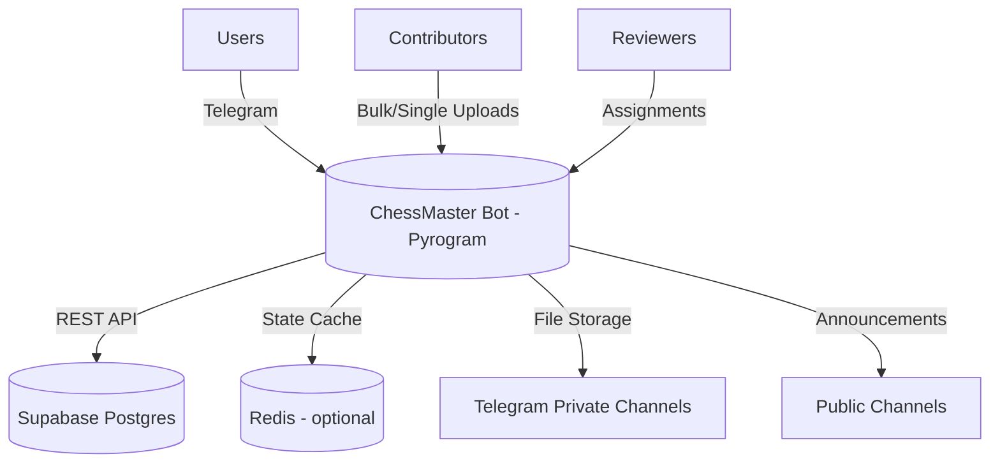
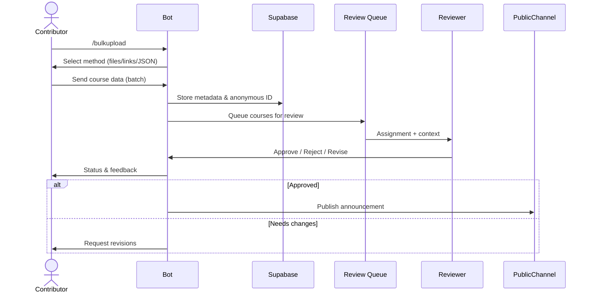

# ChessMaster Community Bot

A Telegram-first platform for sharing, reviewing, and discovering chess courses at scale. Built with a privacy-first identity system, Supabase/Postgres backend, volunteer review network, and anonymous contributor workflow.


## 🌟 Highlights

- **Anonymous by design** – every contributor/reviewer operates through encrypted anonymous IDs (no real identities stored)
- **Bulk & single uploads** – add 1 or 100+ courses; supports PDFs, PGNs, videos, and message links
- **Volunteer review workflow** – priority queue, feedback loops, reviewer performance tracking
- **Searchable catalog** – enhanced metadata (categories, difficulty, tags) with inline search and API access
- **Disaster-ready** – multi-bot failover, Supabase backups, Redis fallback for state management

## 🔗 Quick Links

- [Owner / Developer Reference](docs/OWNER_TECH_GUIDE.md)
- [Setup & Deployment](#-setup--deployment)
- [User Commands](#-user--contributor-commands)
- [Bulk Upload Guide](#-bulk-upload-at-a-glance)

## 👥 Roles at a Glance

| Role | What they do | Key commands |
| --- | --- | --- |
| **User** | Discover & download courses | `/start`, `/help`, `/search`, inline search |
| **Contributor** | Upload single or bulk courses | `/addcourse`, `/bulkupload`, `/bulk_help` |
| **Reviewer** | Approve/decline courses, leave feedback | `/review_queue`, `/review_course`, `/review_stats` |
| **Admin** | Manage roles, channels, analytics, announcements | `/stats`, `/manage_roles`, `/broadcast`, `/batch_status` |

## ⚙️ How the Bot Works (Short Version)

1. **Contributors** upload courses (single or bulk) → files stored in Telegram channels, metadata stored in Supabase.
2. **Reviewers** receive assignments automatically → approve, reject, or request changes.
3. **Approved courses** are announced in public channels and searchable via bot/API.
4. **Users** download courses, leave feedback, and track their learning.
5. **Admins** monitor health, analytics, and manage volunteer network.

## 🧩 Core Feature Sets

### For Users & Learners
- Inline and command-based search with category & difficulty filters
- One-tap course downloads (bundles multi-file courses automatically)
- Notifications for new releases, updates, and collections

### For Contributors (Course Creators)
- Guided upload wizard (`/addcourse`) with resume support
- Bulk course intake (2–100 courses per batch) via files, message links, or JSON
- Batch status tracking (`/batch_status <id>`) with error summaries
- Anonymous identity guarantee – no link between Telegram account and contribution

### For Reviewers (Volunteers)
- Review queue with priority scoring (urgent / normal)
- Structured feedback templates & automated messaging
- Reviewer performance analytics and recognition tiers
- Anonymous operations backed by cryptographic IDs

### For Admins & Maintainers
- Role management & access controls (Super Admin, Admin, Moderator, Reviewer, Contributor)
- Multi-channel management (private storage channels + public announcement feeds)
- Supabase analytics dashboards & nightly logs
- Multi-bot disaster recovery (hot-swap tokens in < 2 minutes)

## 🛡️ Privacy & Security

- Anonymous IDs generated via irreversible SHA-256 hash (trimmed to 32 chars for DB compatibility)
- No Telegram usernames, phone numbers, or real names stored anywhere
- Tokens, metadata, and review logs reside in Supabase (Postgres) with row-level audit history
- Optional Redis cache falls back gracefully to in-memory storage if unavailable

## 🏗️ Architecture



### Course Upload Flow



## 📁 Project Structure

```
ChessMaster/
├── bot.py                    # App entry point (Pyrogram client)
├── core/
│   ├── anonymity.py          # Anonymous identity management
│   ├── bulk_operations.py    # Bulk upload engine
│   ├── enhanced_course_uploader.py # Guided single upload workflow
│   ├── review_queue_manager.py    # Review logistics & assignments
│   ├── supabase_client.py    # REST API client & connection pooling
│   └── ...
├── plugins/
│   ├── enhanced_course_manager.py # Telegram command handlers
│   ├── volunteer_panel.py    # Reviewer tools & dashboards
│   └── ...
├── docs/
│   ├── OWNER_TECH_GUIDE.md   # Owner/developer reference (new)
│   └── prd.md                # Product requirements
└── README.md                 # (You are here)
```

## 🚀 Setup & Deployment

### Prerequisites
- Python 3.10+
- Supabase project (Postgres + REST API)
- Redis (optional; falls back to in-memory if absent)
- Telegram bot token + two channels:
  - Private storage channel (bot must be admin)
  - Public announcement channel (bot must be admin)

### Installation
```bash
git clone https://github.com/your-org/ChessMaster.git
cd ChessMaster
python -m venv .venv
source .venv/bin/activate  # or .venv\Scripts\activate on Windows
pip install -r requirements.txt
```

### Configuration (`.env`)
```
API_ID=123456
API_HASH=your_api_hash
BOT_TOKEN=123456:ABCDEF
ADMINS=123456789 987654321

SUPABASE_URL=https://your-project.supabase.co
SUPABASE_KEY=your_supabase_service_key
SUPABASE_DB_URL=   # optional for direct SQL pool (REST mode if empty)

REDIS_HOST=localhost
REDIS_PORT=6379
REDIS_DB=0

LOG_CHANNEL=-1001234567890
COURSE_CHANNEL=-1009876543210
PUBLIC_CHANNEL=@YourPublicChannel
```

> ✅ `SUPABASE_DB_URL` is optional. When omitted, the bot operates entirely through Supabase REST API (recommended).

### Run the Bot
```bash
python bot.py
```

### Docker (Optional)
```bash
docker build -t chessmaster-bot .
docker run -d --env-file .env chessmaster-bot
```

### Render Deployment (Docker)
- Ensure `.dockerignore` excludes local secrets and heavy assets before pushing.
- Push the repository to GitHub (history already rewritten to a single clean commit).
- In Render, select **New +** → **Blueprint** and point to `render.yaml` in this repo.
- Verify the service type is `web`, plan is `Starter` (or above), and environment is `Docker`.
- Update environment variables in Render → **Environment** tab using `.env-example` as a checklist; never upload `.env`.
- If you do not provision a Redis instance, keep `REDIS_HOST` blank to allow the in-memory fallback; otherwise supply your managed Redis URL.
- Deploy; Render runs the container with `python bot.py` and uses the `/` health check served by the aiohttp web server.

## 🧑‍💻 User & Contributor Commands

### Core Commands
| Command | Description |
| --- | --- |
| `/start` | Welcome message, quick actions |
| `/help` | Short overview of capabilities |
| `/search <query>` | Search published courses |
| `/about` | Bot and community info |
| `/bulk_help` | Detailed bulk upload instructions |
| Inline search | `@YourBot <keywords>` within Telegram |

### Contributor Toolkit
| Command | What it does |
| --- | --- |
| `/addcourse` | Guided single course upload with resume support |
| `/bulkupload` | Start batch upload (files, links, JSON) |
| `/batch_status <id>` | Check batch progress/errors |
| `/my_courses` | View submissions and status |

### Reviewer Toolkit
| Command | What it does |
| --- | --- |
| `/review_queue` | Show assigned courses |
| `/review_course <id>` | Open review interface |
| `/review_stats` | Personal performance metrics |
| `/review_feedback <id>` | Send structured feedback |

### Admin Dashboard
| Command | What it does |
| --- | --- |
| `/stats` | System metrics (users, courses, volunteers) |
| `/manage_roles` | Promote/demote contributors and reviewers |
| `/broadcast <message>` | Announcement to all users |
| `/system_health` | Supabase, Redis, channel checks |
| `/tokens ...` | Manage invite / verification tokens |

## 📦 Bulk Upload at a Glance

1. `/bulkupload` → choose method
2. Provide course data (files, message links, or JSON)
3. Type `PROCESS`
4. Watch real-time progress updates
5. Use `/batch_status <batch_id>` to check results
6. Courses automatically enter review queue

> **Tip:** Each batch stores processing metadata (success, failure reasons, timestamps) and can be reprocessed if needed.

## 🧪 Testing & Maintenance

- **Quick smoke test:** `python quick_bot_status_check.py`
- **Bulk operations test:** use `/bulkupload` in a private chat and confirm batch status output
- **Review simulation:** assign test accounts as reviewers and walk through approval flow

## 💬 Contributing
Pull requests are welcome! Focus areas:
- Reviewer analytics UI
- Web dashboard for admins
- Additional Supabase policies & automation scripts

---

Built for the ChessMaster community to scale quality chess education while safeguarding contributor privacy. 🏁
