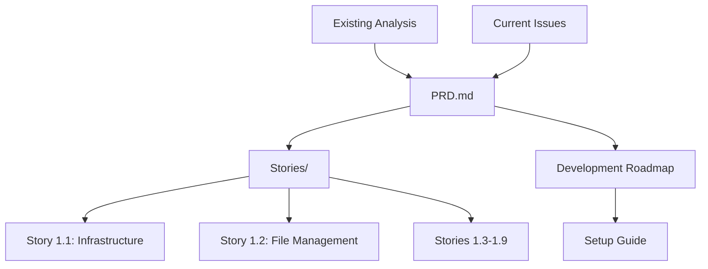

# ChessMaster Project Documentation Index

## 📋 Complete Project Documentation

This directory contains all documentation for the ChessMaster Community Platform Enhancement project.

---

## 🎯 Core Documentation

### **[📋 Product Requirements Document (PRD)](./prd.md)**
Complete product requirements and technical specifications for transforming ChessMaster from prototype to production-ready community platform.
- **28,000+ characters** of detailed requirements
- Anonymous community architecture specifications  
- Technical constraints and integration requirements
- Epic and story structure with acceptance criteria

### **[📊 PRD Executive Summary](./prd/prd-summary.md)**
High-level overview of the enhancement project with key objectives, technical architecture, and implementation approach.
- Project transformation overview
- Success criteria and metrics
- Cost-effective strategy using free tiers
- Implementation timeline and next steps

---

## 📝 Implementation Stories

### **[📖 Stories Overview](./stories/README.md)**
Complete breakdown of all 9 user stories organized in 3 phases with progress tracking and success metrics.

### **Phase 1: Foundation Stories**
- **[🔧 Story 1.1: Core Infrastructure Foundation](./stories/story-1-1-infrastructure.md)**
  - Supabase migration from MongoDB
  - Anonymous ID system implementation
  - Role-based permission framework  
  - Redis state management

- **[📁 Story 1.2: Enhanced Multi-Channel File Management](./stories/story-1-2-file-management.md)**
  - Multi-channel Telegram hosting with backup redundancy
  - Anonymous file forwarding system
  - Health monitoring and intelligent failover

### **Phase 2 & 3: Community and Scale Stories**
Remaining 7 stories covering volunteer workflows, disaster recovery, analytics, and future integration capabilities.

---

## 🛠️ Development Resources

### **[🚀 Development Roadmap](./development-roadmap.md)**
Complete 8-10 week implementation timeline with technical strategy, testing phases, and launch preparation.
- **9,000+ characters** of detailed planning
- Week-by-week development schedule
- Technical architecture decisions
- Success metrics and KPIs

### **[⚙️ Setup Guide](../SETUP.md)**
Comprehensive development environment setup instructions with troubleshooting and deployment procedures.

---

## 📊 Existing Analysis Documentation

### **[🔍 Codebase Analysis](./CODEBASE_ANALYSIS.md)**
Comprehensive technical analysis of current ChessMaster implementation (27,743 characters).

### **[🚨 Current Issues](./CURRENT_ISSUES.md)**
Detailed issue identification and solutions (24,793 characters).

### **[🎯 Enhancement Roadmap](./ENHANCEMENT_ROADMAP.md)**
Strategic enhancement recommendations (56,179 characters).

### **[📈 Executive Summary](./EXECUTIVE_SUMMARY.md)**
High-level overview and action items with investment analysis.

---

## 📚 Document Relationships

## 🎯 Quick Navigation

### **For Product Managers**
- Start with **[PRD Summary](./prd/prd-summary.md)** for overview
- Review **[Complete PRD](./prd.md)** for detailed requirements
- Check **[Development Roadmap](./development-roadmap.md)** for timeline

### **For Developers**
- Start with **[Setup Guide](../SETUP.md)** for environment configuration
- Review **[Stories Overview](./stories/README.md)** for implementation details
- Follow **[Story 1.1](./stories/story-1-1-infrastructure.md)** and **[Story 1.2](./stories/story-1-2-file-management.md)** for foundation work

### **For Stakeholders**
- Read **[PRD Summary](./prd/prd-summary.md)** for key benefits and timeline
- Review **[Executive Summary](./EXECUTIVE_SUMMARY.md)** for investment analysis
- Check **[Development Roadmap](./development-roadmap.md)** for implementation approach

---

## 📊 Documentation Statistics

| Document | Characters | Purpose |
|----------|------------|---------|
| PRD.md | 28,009 | Complete product requirements |
| Story 1.1 | 6,689 | Infrastructure implementation |  
| Story 1.2 | 9,641 | File management system |
| Development Roadmap | 9,226 | Implementation timeline |
| PRD Summary | 4,626 | Executive overview |
| **Total New Docs** | **58,191** | **Complete project specification** |

## 🎯 Project Status

- ✅ **Requirements Complete**: Comprehensive PRD with all specifications
- ✅ **Stories Defined**: 9 detailed user stories with acceptance criteria  
- ✅ **Architecture Planned**: Technical approach and implementation strategy
- ✅ **Timeline Established**: 8-10 week development roadmap
- 🚧 **Ready for Development**: All documentation complete, implementation can begin

---

**Complete Project Documentation**: All necessary files created for development team execution. Ready to transform ChessMaster from prototype to production-ready community platform.