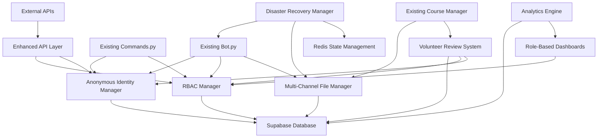

# ChessMaster Brownfield Enhancement Architecture

## Change Log

| Change | Date | Version | Description | Author |
|--------|------|---------|-------------|---------|
| Initial Creation | 2024-12-25 | v1.0 | Complete brownfield enhancement architecture created | Winston (Architect) |

---

## Introduction

This document outlines the architectural approach for enhancing **ChessMaster** with **complete transformation from prototype to production-ready community platform featuring Supabase migration, anonymous contributor management, role-based access control, multi-channel resilience, and disaster recovery capabilities**. Its primary goal is to serve as the guiding architectural blueprint for AI-driven development of new features while ensuring seamless integration with the existing system.

**Relationship to Existing Architecture:**
This document supplements existing project architecture by defining how new components will integrate with current systems. Where conflicts arise between new and existing patterns, this document provides guidance on maintaining consistency while implementing enhancements.

## Existing Project Analysis

### Current Project State
- **Primary Purpose:** Chess Courses Bot - a sophisticated Telegram bot platform for sharing and managing chess educational content with automated channel management
- **Current Tech Stack:** Python 3.x + Pyrogram 2.0.106 + MongoDB (pymongo/motor) + Docker + aiohttp web server
- **Architecture Style:** Plugin-based modular architecture with centralized database layer and async bot framework
- **Deployment Method:** Docker containerization with web server integration (designed for platforms like Render/Heroku)

### Available Documentation
- ✅ Comprehensive PRD (430+ lines) with detailed enhancement requirements
- ✅ Plugin-based code organization (commands.py, course_manager.py, inline.py, premium.py, token_commands.py)
- ✅ Database layer with multiple collections (users, courses, files, tokens, premium users)
- ✅ Configuration-driven environment setup with extensive feature flags
- ✅ Docker deployment setup with restart policies

### Identified Constraints
- **MongoDB Synchronous Operations:** Current database operations are synchronous, causing performance bottlenecks for community scale
- **In-Memory State Management:** temp.py usage for session state creates data loss risk during restarts
- **Single Bot Token Architecture:** No disaster recovery mechanism for bot failures
- **Limited Role-Based Access:** Basic admin/user distinction without granular permissions
- **No Anonymous Identity System:** Contributors/volunteers are tied to Telegram accounts
- **Single Channel File Storage:** No redundancy for file hosting across multiple channels

## Enhancement Scope and Integration Strategy

### Enhancement Overview
**Enhancement Type:** Major Architectural Transformation with Database Migration  
**Scope:** Complete transformation from MongoDB prototype to production-ready Supabase platform with anonymous community management, role-based access control, multi-channel resilience, and disaster recovery capabilities  
**Integration Impact:** High Impact - Fundamental database layer replacement while preserving existing plugin architecture and user workflows

### Integration Approach
**Code Integration Strategy:** Preserve existing plugin architecture and command structure while implementing new core modules (anonymity.py, roles.py, disaster_recovery.py, supabase_client.py) and enhanced database layer with async operations

**Database Integration:** Complete migration from MongoDB to Supabase (PostgreSQL) with data integrity verification, anonymous ID conversion, and zero-downtime transition using migration scripts and parallel operation during cutover

**API Integration:** Maintain existing Pyrogram bot API patterns while adding new RESTful endpoints for external integrations, volunteer dashboards, and bulk operations with same authentication flow

**UI Integration:** Preserve existing Telegram bot command structure and inline keyboards while adding role-based menu systems, volunteer review interfaces, and enhanced admin panels through progressive disclosure

### Compatibility Requirements
- **Existing API Compatibility:** All current bot commands (/start, /addcourse, /stats, /broadcast) maintain identical user interface and behavior patterns
- **Database Schema Compatibility:** Migration scripts ensure complete data preservation with anonymous ID mapping and metadata enhancement without data loss
- **UI/UX Consistency:** New community features integrate seamlessly through role-based menu extensions and callback query patterns matching existing inline keyboard design
- **Performance Impact:** Enhanced performance through async operations and Redis caching while maintaining <2 second response times for existing functionality

## Tech Stack

### Existing Technology Stack
| Category | Current Technology | Version | Usage in Enhancement | Notes |
|----------|-------------------|---------|---------------------|-------|
| **Language** | Python | 3.7+ | Core language maintained | All new modules in Python |
| **Bot Framework** | Pyrogram | 2.0.106 | Preserved for all bot operations | Plugin system maintained |
| **Database (Current)** | MongoDB | pymongo 4.5.0, motor 3.2.0 | Complete replacement with migration | Prototype database being retired |
| **Web Framework** | aiohttp | 3.8.5 | Enhanced for API endpoints | Extended for volunteer interfaces |
| **Containerization** | Docker | Latest | Enhanced deployment scripts | Multi-bot token support added |
| **Process Management** | asyncio | Built-in | Enhanced for concurrent operations | Improved error handling |
| **Configuration** | Environment Variables | Built-in | Preserved pattern | Extended for new services |

### New Technology Additions
| Technology | Version | Purpose | Rationale | Integration Method |
|------------|---------|---------|-----------|-------------------|
| **Supabase Client** | supabase-py 2.0+ | Production database with real-time features | Modern async PostgreSQL with built-in scalability and real-time subscriptions | Replace MongoDB client, maintain same database interface patterns |
| **Redis** | redis-py 5.0+ | State management and caching | Replace in-memory temp storage with persistent, distributed cache | Integration with existing temp.py patterns |
| **asyncpg** | 0.28+ | Direct PostgreSQL async operations | High-performance database operations for community scale | Used within Supabase client for optimized queries |
| **cryptography** | 41.0+ | Anonymous ID generation | Secure hash generation for contributor anonymity | New core module for identity management |
| **APScheduler** | 3.10+ | Scheduled tasks and cleanup | Disaster recovery health checks and maintenance | Background task management |

## Data Models and Schema Changes

### New Data Models

#### Anonymous Users
**Purpose:** Complete user anonymity system replacing direct Telegram ID storage  
**Integration:** Maps to existing user management while providing cryptographic anonymity

**Key Attributes:**
- `anonymous_id`: TEXT PRIMARY KEY - Cryptographically generated hash with no reverse lookup capability
- `telegram_id_hash`: TEXT UNIQUE - One-way hash of Telegram ID for session mapping only
- `role`: TEXT DEFAULT 'contributor' - Role-based access control (super_admin, admin, moderator, volunteer_reviewer, contributor)
- `created_at`: TIMESTAMP - Account creation for analytics
- `last_active`: TIMESTAMP - Activity tracking for community health
- `permissions`: JSONB - Granular permission flags for role customization
- `referral_code`: TEXT UNIQUE - Anonymous referral system for premium features
- `is_premium`: BOOLEAN DEFAULT false - Premium status preservation
- `metadata`: JSONB - Extensible anonymous profile data

**Relationships:**
- **With Existing:** Replaces users_collection with anonymous mapping
- **With New:** One-to-many with course_submissions, review_assignments, analytics_events

#### Multi-Channel File Storage
**Purpose:** Redundant file storage across multiple Telegram channels with failover  
**Integration:** Enhances existing course file management with bulletproof availability

**Key Attributes:**
- `file_id`: UUID PRIMARY KEY - Unique identifier for file tracking
- `original_message_id`: BIGINT - Source message for file extraction
- `primary_channel_msg_id`: BIGINT - Primary channel message link
- `backup_channels`: JSONB - Array of backup channel message IDs
- `file_metadata`: JSONB - Size, type, duration from existing file handling
- `anonymous_uploader`: TEXT REFERENCES anonymous_users(anonymous_id) - Anonymous attribution
- `health_status`: TEXT DEFAULT 'active' - Channel availability monitoring
- `last_verified`: TIMESTAMP - Health check timestamp
- `access_count`: INTEGER DEFAULT 0 - Usage analytics

**Relationships:**
- **With Existing:** Extends FILES_COLLECTION functionality
- **With New:** Many-to-one with courses, one-to-many with access_logs

#### Community Roles & Permissions
**Purpose:** Granular role-based access control for community management  
**Integration:** Replaces simple ADMINS list with sophisticated permission system

**Key Attributes:**
- `role_id`: UUID PRIMARY KEY - Role identifier
- `role_name`: TEXT UNIQUE - Human-readable role name
- `permissions`: JSONB - Detailed permission flags (course_approve, user_manage, analytics_view, etc.)
- `hierarchy_level`: INTEGER - Role precedence for override logic
- `assignment_method`: TEXT - How users get this role (auto, manual, conditional)
- `max_assignments`: INTEGER NULL - Limit on role assignments (for volunteers)
- `created_at`: TIMESTAMP - Role creation tracking

**Relationships:**
- **With Existing:** Replaces AUTH_USERS and ADMINS configuration
- **With New:** One-to-many with role_assignments, permission_overrides

#### Volunteer Review System
**Purpose:** Course quality control workflow with anonymous volunteer assignment  
**Integration:** Extends existing course upload process with quality gates

**Key Attributes:**
- `review_id`: UUID PRIMARY KEY - Review session identifier
- `course_submission_id`: UUID REFERENCES course_submissions(id) - Course being reviewed
- `assigned_reviewer`: TEXT REFERENCES anonymous_users(anonymous_id) - Anonymous reviewer
- `review_status`: TEXT DEFAULT 'pending' - pending, approved, rejected, needs_revision
- `review_feedback`: TEXT - Structured feedback for contributor
- `review_criteria`: JSONB - Quality checklist results
- `assigned_at`: TIMESTAMP - Assignment time for workload tracking
- `completed_at`: TIMESTAMP NULL - Completion time for performance metrics
- `priority_level`: INTEGER DEFAULT 1 - Queue priority for urgent reviews

**Relationships:**
- **With Existing:** Integrates with course approval workflow
- **With New:** Many-to-one with course_submissions, one-to-one with review_analytics

### Schema Integration Strategy

**Database Changes Required:**
- **New Tables:** anonymous_users, multi_channel_files, community_roles, role_assignments, volunteer_reviews, course_submissions, analytics_events, disaster_recovery_configs
- **Modified Tables:** None (clean migration with data transformation)
- **New Indexes:** anonymous_id, telegram_id_hash, role lookups, file health status, review queues, timestamp ranges for analytics
- **Migration Strategy:** Parallel operation during cutover with integrity verification scripts and rollback procedures

**Backward Compatibility:**
- Migration scripts transform existing MongoDB collections to anonymous Supabase schema with cryptographic ID generation
- API compatibility layer maintains existing database interface patterns during transition period
- Data integrity verification ensures zero data loss with comprehensive validation checks

## Component Architecture

### New Components

#### Anonymous Identity Manager
**Responsibility:** Cryptographic anonymous ID generation, session mapping, and privacy protection throughout all system operations  
**Integration Points:** Integrates with all existing user interactions through database abstraction layer

**Key Interfaces:**
- `generate_anonymous_id(telegram_id)` - Creates cryptographic hash with no reverse lookup
- `get_session_mapping(anonymous_id)` - Maps anonymous ID to active Telegram session
- `verify_privacy_compliance()` - Ensures no identity correlation across system

**Dependencies:**
- **Existing Components:** users_chats_db.py, all plugin commands requiring user identification
- **New Components:** Role Manager, Analytics Engine, Volunteer Dashboard

**Technology Stack:** Python cryptography library, secure random generation, PostgreSQL integration

#### Role-Based Access Control (RBAC) Manager
**Responsibility:** Granular permission enforcement, role hierarchy management, and volunteer assignment distribution  
**Integration Points:** Wraps all existing admin checks and command handlers with enhanced permission validation

**Key Interfaces:**
- `check_permission(anonymous_id, permission_name)` - Replace existing admin checks
- `assign_role(anonymous_id, role_name)` - Dynamic role assignment
- `get_role_dashboard(anonymous_id)` - Role-specific UI generation

**Dependencies:**
- **Existing Components:** commands.py admin decorators, premium.py user validation
- **New Components:** Anonymous Identity Manager, Volunteer Review System

**Technology Stack:** PostgreSQL JSONB permissions, async permission caching, Redis role cache

#### Multi-Channel File Manager
**Responsibility:** Redundant file storage across multiple Telegram channels, health monitoring, and intelligent failover  
**Integration Points:** Replaces existing single-channel file operations with multi-channel redundancy

**Key Interfaces:**
- `store_file_redundantly(file_data, channels)` - Multi-channel upload with verification
- `retrieve_file_with_failover(file_id)` - Intelligent failover retrieval
- `monitor_channel_health()` - Background health checking and alerting

**Dependencies:**
- **Existing Components:** course_manager.py file handling, courses_db.py file storage
- **New Components:** Disaster Recovery Manager, Analytics Engine

**Technology Stack:** Pyrogram multi-client management, asyncio concurrent operations, Supabase metadata storage

#### Volunteer Review System
**Responsibility:** Course quality control workflow, reviewer assignment, and approval/rejection processing  
**Integration Points:** Extends existing /addcourse workflow with quality gates and volunteer coordination

**Key Interfaces:**
- `queue_for_review(course_submission)` - Add course to volunteer review queue
- `assign_reviewer(course_id, volunteer_pool)` - Balanced reviewer assignment
- `process_review_decision(review_id, decision, feedback)` - Handle approval/rejection

**Dependencies:**
- **Existing Components:** course_manager.py upload workflow, commands.py admin course approval
- **New Components:** RBAC Manager, Anonymous Identity Manager, Analytics Engine

**Technology Stack:** PostgreSQL queue management, async task distribution, Telegram inline keyboards

#### Disaster Recovery & Multi-Bot Manager
**Responsibility:** Multi-bot token management, automated failover, and rapid system recovery  
**Integration Points:** Wraps existing bot initialization with multi-token support and health monitoring

**Key Interfaces:**
- `initialize_multi_bot_system(token_pool)` - Setup multiple bot instances
- `execute_failover(failed_token, backup_token)` - Seamless bot token switching
- `restore_system_state(recovery_point)` - Complete system restoration

**Dependencies:**
- **Existing Components:** bot.py initialization, all plugin command handlers
- **New Components:** Multi-Channel File Manager, RBAC Manager

**Technology Stack:** Multiple Pyrogram clients, Docker orchestration, automated deployment scripts

#### Community Analytics Engine
**Responsibility:** Real-time community health metrics, engagement analytics, and performance tracking  
**Integration Points:** Passive monitoring of all existing operations with role-based dashboard access

**Key Interfaces:**
- `track_community_event(event_type, anonymous_user, metadata)` - Event capture
- `generate_dashboard(role, time_range)` - Role-based analytics views
- `trigger_community_alerts(threshold_breach)` - Automated health alerts

**Dependencies:**
- **Existing Components:** All plugin operations for event tracking
- **New Components:** Anonymous Identity Manager, RBAC Manager

**Technology Stack:** Supabase real-time subscriptions, PostgreSQL analytics queries, Redis caching

### Component Interaction Diagram



## API Design and Integration

### API Integration Strategy
**API Integration Strategy:** Extend existing aiohttp web server with RESTful endpoints while preserving Telegram bot as primary interface, enabling external integrations for bulk operations and volunteer dashboards  
**Authentication:** JWT token-based authentication integrated with existing anonymous identity system and role-based permissions  
**Versioning:** URL-based versioning (/api/v1/) with backward compatibility guarantees for external integrations

### New API Endpoints

#### Bulk Course Upload API
- **Method:** POST
- **Endpoint:** `/api/v1/courses/bulk-upload`
- **Purpose:** Enable external systems to upload multiple courses while maintaining anonymity and quality control
- **Integration:** Integrates with existing course upload workflow and volunteer review system

##### Request
```json
{
  "courses": [
    {
      "title": "Advanced Chess Tactics",
      "description": "Comprehensive tactics course",
      "files": [
        {
          "url": "https://example.com/file1.pdf",
          "filename": "tactics_chapter1.pdf",
          "file_type": "document"
        }
      ],
      "tags": ["tactics", "advanced", "intermediate"],
      "category": "tactics"
    }
  ],
  "anonymous_contributor_id": "anon_hash_123456",
  "bulk_upload_metadata": {
    "source_system": "external_cms",
    "batch_id": "batch_2024_001"
  }
}
```

##### Response
```json
{
  "success": true,
  "batch_id": "bulk_upload_uuid_789",
  "courses_processed": 1,
  "review_queue_positions": [
    {
      "course_id": "course_uuid_456",
      "queue_position": 3,
      "estimated_review_time": "2-4 hours"
    }
  ],
  "errors": []
}
```

#### Volunteer Dashboard API
- **Method:** GET
- **Endpoint:** `/api/v1/volunteer/dashboard/{anonymous_id}`
- **Purpose:** Provide volunteer reviewers with dedicated dashboard access outside Telegram interface
- **Integration:** Integrates with existing volunteer review system and role-based access controls

##### Request
```json
{
  "time_range": "last_7_days",
  "include_completed": true,
  "priority_filter": ["high", "medium"]
}
```

##### Response
```json
{
  "volunteer_stats": {
    "pending_reviews": 5,
    "completed_this_week": 12,
    "average_review_time": "45_minutes",
    "reviewer_ranking": 3
  },
  "pending_queue": [
    {
      "review_id": "review_uuid_123",
      "course_title": "Chess Endgames Mastery",
      "submitted_date": "2024-12-25T10:30:00Z",
      "priority": "high",
      "estimated_time": "30_minutes",
      "files_count": 3
    }
  ],
  "recent_activity": []
}
```

#### Community Analytics API
- **Method:** GET
- **Endpoint:** `/api/v1/analytics/community-health`
- **Purpose:** Provide real-time community metrics for administrators and external monitoring systems
- **Integration:** Integrates with analytics engine and role-based dashboard access

##### Request
```json
{
  "metrics": ["user_growth", "course_approval_rate", "volunteer_efficiency"],
  "time_range": "last_30_days",
  "aggregation": "daily"
}
```

##### Response
```json
{
  "community_health": {
    "total_active_users": 8750,
    "growth_rate": "+12.5%",
    "course_approval_rate": "94.2%",
    "volunteer_efficiency": {
      "average_review_time": "42_minutes",
      "reviews_per_volunteer_per_week": 8.3
    }
  },
  "time_series_data": {
    "user_growth": [
      {"date": "2024-12-01", "new_users": 45},
      {"date": "2024-12-02", "new_users": 52}
    ]
  }
}
```

#### Anonymous Identity Management API
- **Method:** POST
- **Endpoint:** `/api/v1/identity/generate-anonymous`
- **Purpose:** Enable external systems to create anonymous identities for new contributors
- **Integration:** Integrates with anonymous identity manager and role assignment system

##### Request
```json
{
  "initial_role": "contributor",
  "metadata": {
    "source_system": "external_registration",
    "registration_context": "bulk_contributor_onboarding"
  },
  "permissions": ["course_upload", "basic_analytics_view"]
}
```

##### Response
```json
{
  "success": true,
  "anonymous_id": "anon_hash_new_789456",
  "api_token": "jwt_token_for_future_requests",
  "assigned_role": "contributor",
  "available_endpoints": [
    "/api/v1/courses/upload",
    "/api/v1/courses/my-submissions"
  ]
}
```

## Source Tree

### Existing Project Structure
```
ChessMaster/
├── bot.py                    # Main bot initialization
├── info.py                   # Configuration management
├── utils.py                  # Utility functions
├── plugins/                  # Plugin-based architecture
│   ├── commands.py          # Core bot commands
│   ├── course_manager.py    # Course upload/management
│   ├── inline.py            # Inline query handling
│   ├── premium.py           # Premium features
│   └── token_commands.py    # Token verification
├── database/                 # Database layer
│   ├── users_chats_db.py    # User management
│   ├── courses_db.py        # Course data
│   ├── db_helpers.py        # Database utilities
│   └── multi_db.py          # Multi-database support
└── docker-compose.yml       # Container orchestration
```

### New File Organization
```
ChessMaster/
├── bot.py                    # Enhanced with multi-bot support
├── info.py                   # Extended configuration
├── utils.py                  # Enhanced utilities
├── core/                     # New core functionality
│   ├── __init__.py
│   ├── anonymity.py         # Anonymous identity management
│   ├── roles.py             # Role-based access control
│   ├── disaster_recovery.py # Multi-bot resilience
│   └── supabase_client.py   # Database connection management
├── plugins/                  # Enhanced plugin system
│   ├── commands.py          # Existing commands (preserved)
│   ├── course_manager.py    # Enhanced course workflow
│   ├── inline.py            # Preserved inline functionality
│   ├── premium.py           # Preserved premium features
│   ├── token_commands.py    # Preserved token system
│   ├── volunteer_panel.py   # New volunteer interfaces
│   ├── admin_enhanced.py    # Enhanced admin capabilities
│   └── community_stats.py   # Community analytics
├── database/                 # Supabase integration layer
│   ├── __init__.py
│   ├── models.py            # Data models and schemas
│   ├── courses.py           # Enhanced course operations
│   ├── users.py             # Anonymous user management
│   ├── files.py             # Multi-channel file management
│   ├── reviews.py           # Volunteer review operations
│   ├── analytics.py         # Statistics and metrics
│   └── migrations/          # Database migration scripts
│       ├── mongodb_to_supabase.py
│       └── data_integrity_check.py
├── api/                      # New REST API layer
│   ├── __init__.py
│   ├── auth.py              # JWT authentication
│   ├── routes/
│   │   ├── courses.py       # Course management endpoints
│   │   ├── volunteers.py    # Volunteer dashboard APIs
│   │   └── analytics.py     # Community metrics APIs
│   └── middleware.py        # API middleware
├── scripts/                  # Operational scripts
│   ├── deployment.py        # Automated deployment
│   ├── health_check.py      # System monitoring
│   └── backup_restore.py    # Disaster recovery
└── docker-compose.yml       # Enhanced with Redis
```

### Integration Guidelines
- **File Naming:** Maintain existing snake_case convention with descriptive module names
- **Folder Organization:** New directories follow existing pattern with clear separation of concerns
- **Import/Export Patterns:** Preserve existing relative imports while adding new core module imports

## Infrastructure and Deployment Integration

### Existing Infrastructure
**Current Deployment:** Docker containerization with single-service architecture for cloud platforms  
**Infrastructure Tools:** Docker Compose, environment variable configuration, health check endpoints  
**Environments:** Production deployment with restart policies and volume mounting

### Enhancement Deployment Strategy
**Deployment Approach:** Enhanced Docker Compose with Redis service, multi-bot configuration, and automated deployment scripts  
**Infrastructure Changes:** Add Redis container, environment variable extensions for Supabase, multi-bot token management  
**Pipeline Integration:** Automated deployment scripts with health monitoring and failover capabilities

### Rollback Strategy
**Rollback Method:** Automated rollback to previous MongoDB version with data restoration from Supabase backup  
**Risk Mitigation:** Parallel operation during cutover with instant fallback capabilities  
**Monitoring:** Real-time health checks with automated alerts and disaster recovery triggers

## Coding Standards

### Existing Standards Compliance
**Code Style:** Python PEP 8 with snake_case naming, async/await patterns, comprehensive error handling  
**Linting Rules:** Standard Python linting with asyncio best practices  
**Testing Patterns:** Unit testing framework to be implemented with pytest  
**Documentation Style:** Inline comments and docstrings following Google style

### Critical Integration Rules
- **Existing API Compatibility:** All new database operations maintain same interface as existing MongoDB operations
- **Database Integration:** Async operations throughout with proper connection pooling and error handling
- **Error Handling:** Comprehensive exception handling with graceful degradation and user-friendly error messages
- **Logging Consistency:** Structured logging with consistent format and appropriate log levels

## Testing Strategy

### Integration with Existing Tests
**Existing Test Framework:** Currently minimal - will implement comprehensive testing framework  
**Test Organization:** New test/ directory with integration, unit, and end-to-end testing  
**Coverage Requirements:** 80%+ coverage for new components, full regression testing for existing functionality

### New Testing Requirements

#### Unit Tests for New Components
- **Framework:** pytest with asyncio support
- **Location:** tests/unit/ directory structure mirroring source code
- **Coverage Target:** 85% for new core modules and API endpoints
- **Integration with Existing:** Comprehensive mocking of Telegram API and database operations

#### Integration Tests
- **Scope:** Complete workflow testing from course upload through volunteer review to publication
- **Existing System Verification:** All current bot commands and workflows validated
- **New Feature Testing:** Anonymous identity flows, role-based access, multi-channel operations

#### Regression Testing
- **Existing Feature Verification:** Automated test suite ensuring no functionality degradation
- **Automated Regression Suite:** CI/CD integration with deployment blocking on test failures
- **Manual Testing Requirements:** User acceptance testing for new community features

## Security Integration

### Existing Security Measures
**Authentication:** Telegram bot token authentication, admin user ID validation  
**Authorization:** Basic admin/user role distinction  
**Data Protection:** Environment variable configuration, secure token handling  
**Security Tools:** Standard Python security practices

### Enhancement Security Requirements
**New Security Measures:** Anonymous ID cryptographic generation, JWT token management, role-based permission enforcement, API rate limiting  
**Integration Points:** Security middleware for API endpoints, enhanced authentication for multi-bot operations  
**Compliance Requirements:** Privacy-first design with complete anonymity guarantees

### Security Testing
**Existing Security Tests:** Basic authentication validation  
**New Security Test Requirements:** Anonymous ID security validation, role-based access testing, API security validation  
**Penetration Testing:** Community-scale security assessment with anonymity verification

## Next Steps

### Story Manager Handoff
**Prompt for Story Manager:**
"Please use the ChessMaster Brownfield Enhancement Architecture (docs/architecture.md) as the foundation for implementing the PRD requirements. The architecture has been validated with the user and provides detailed integration guidance for transforming the MongoDB prototype to a Supabase production platform with anonymous community management. 

Key integration requirements validated:
- Preserve existing plugin architecture and command structure
- Maintain all current bot functionality during database migration
- Implement anonymous identity system with cryptographic privacy protection
- Enable community-scale operations with role-based access control

Start with Story 1.1 (Core Infrastructure Foundation) focusing on Supabase integration and anonymous user management. Each story must include specific integration checkpoints to ensure existing system integrity throughout implementation."

### Developer Handoff
**Prompt for developers:**
"Begin implementation using the ChessMaster Brownfield Enhancement Architecture (docs/architecture.md) which defines how to enhance the existing Python/Pyrogram bot with Supabase and community features.

The architecture preserves your current plugin system while adding:
- core/ modules for anonymity, roles, and disaster recovery
- Enhanced database/ layer with Supabase integration
- New api/ layer for external integrations

Technical decisions based on actual project analysis:
- Maintain existing bot.py initialization patterns with multi-bot enhancement
- Preserve current plugin command structure and inline keyboard patterns
- Use existing environment variable configuration extended for Supabase
- Follow established async/await patterns throughout new components

Implementation sequence to minimize risk:
1. Supabase client setup and connection testing
2. Anonymous identity system with existing user migration
3. Role-based access control wrapping current admin checks
4. Multi-channel file management enhancing current course storage
5. Volunteer review system extending current course workflow

Each component must maintain compatibility with existing functionality and include comprehensive integration verification."

---

*This architecture document provides the complete blueprint for transforming ChessMaster from a MongoDB prototype to a production-ready Supabase community platform while preserving all existing functionality and ensuring seamless user experience throughout the enhancement process.*

**Document Version:** 1.0  
**Created:** December 25, 2024  
**Author:** Winston (Architect)  
**Next Review:** Story Implementation Phase